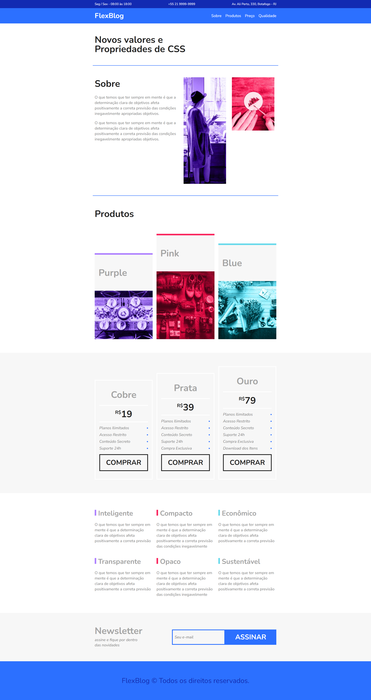

# 📰 FlexBlog – Curso Origamid

Projeto desenvolvido como parte do curso **[CSS Flexbox](https://www.origamid.com/curso/css-flexbox/)** da Origamid.  
O **FlexBlog** é um site de página única (single page) que serviu para aplicar praticamente todas as propriedades do Flexbox aprendidas no curso.

---

## 🚀 Preview

🔗 [Acesse o projeto online aqui](https://thur-code.github.io/flexblog-origamid/)

  

---

## 🛠 Tecnologias e ferramentas usadas

- HTML5 (estrutura semântica, tags principais)  
- CSS3 com foco em Flexbox (todas as propriedades fundamentais)    
- Layout responsivo baseado em flex containers e flex items  

---

## 🎯 Conteúdo aplicado / aprendizagem

Durante o projeto foram aplicados:

- **Fundamentos do Flexbox**: `display: flex`, `flex-direction`, `flex-wrap`, `flex-flow`  
- **Alinhamento e distribuição de espaço**: `justify-content`, `align-items`, `align-content`  
- **Propriedades de flex items**: `flex-grow`, `flex-basis`, `flex-shrink`, `order`, `align-self`  

---

## 📂 Status

✅ Concluído

---

## 📝 Observações

- Projeto feito de forma guiada durante as aulas do curso Origamid.  
- O objetivo foi aprender e aplicar Flexbox de forma prática, entendendo bem como cada propriedade afeta os elementos no layout.